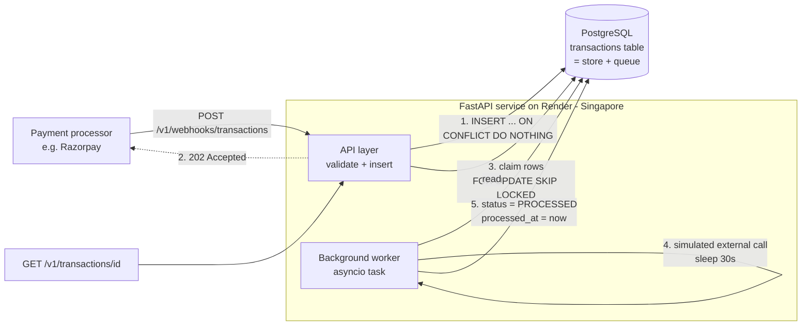
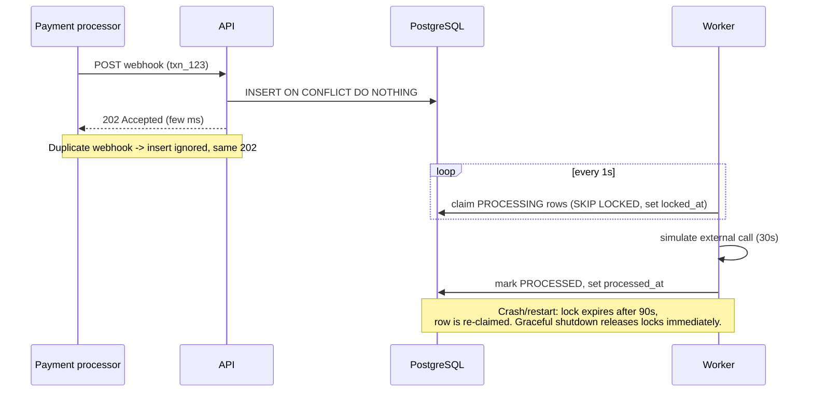

## Architecture
 

```mermaid
flowchart LR
    PP[Payment processor<br/>e.g. Razorpay] -->|POST /v1/webhooks/transactions| API
 
    subgraph SVC[FastAPI service on Render - Singapore]
        API[API layer<br/>validate + insert]
        W[Background worker<br/>asyncio task]
    end
 
    API -->|1. INSERT ... ON CONFLICT DO NOTHING| DB[(PostgreSQL<br/>transactions table<br/>= store + queue)]
    API -.->|2. 202 Accepted| PP
    W -->|3. claim rows<br/>FOR UPDATE SKIP LOCKED| DB
    W -->|4. simulated external call<br/>sleep 30s| W
    W -->|5. status = PROCESSED<br/>processed_at = now| DB
    Q[GET /v1/transactions/id] --> API
    API -->|read| DB
```
 
### Request lifecycle
 

```mermaid
sequenceDiagram
    participant P as Payment processor
    participant A as API
    participant D as PostgreSQL
    participant W as Worker
 
    P->>A: POST webhook (txn_123)
    A->>D: INSERT ON CONFLICT DO NOTHING
    A-->>P: 202 Accepted (few ms)
    Note over P,A: Duplicate webhook -> insert ignored, same 202
 
    loop every 1s
        W->>D: claim PROCESSING rows (SKIP LOCKED, set locked_at)
    end
    W->>W: simulate external call (30s)
    W->>D: mark PROCESSED, set processed_at
 
    Note over W,D: Crash/restart: lock expires after 90s,<br/>row is re-claimed. Graceful shutdown releases locks immediately.
```
